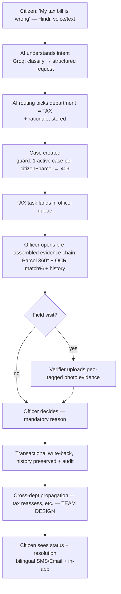
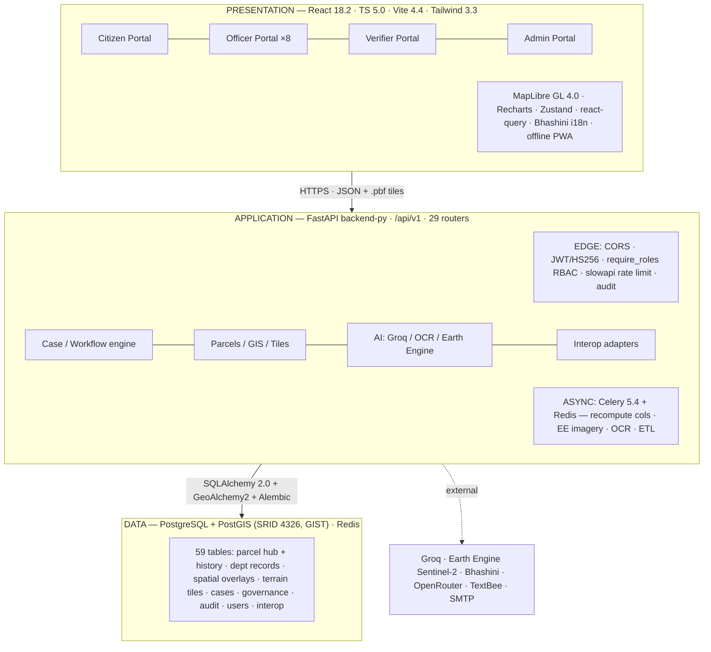
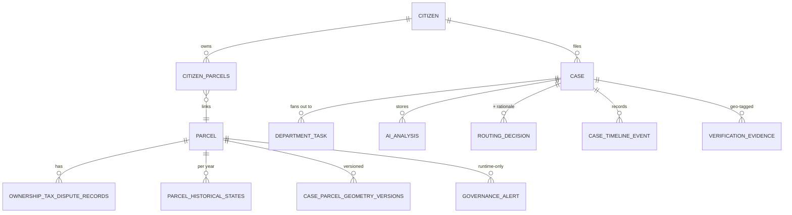
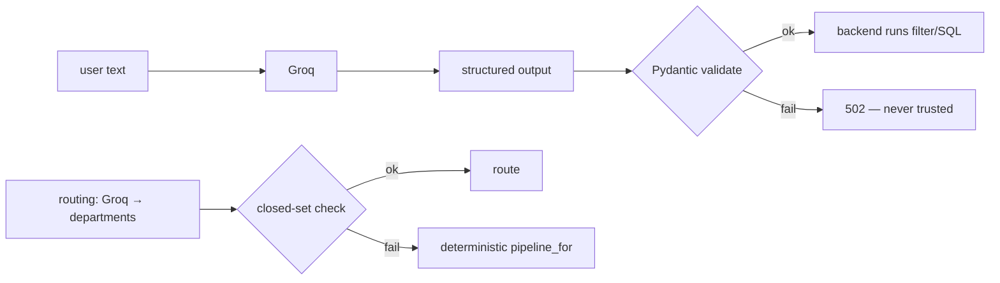
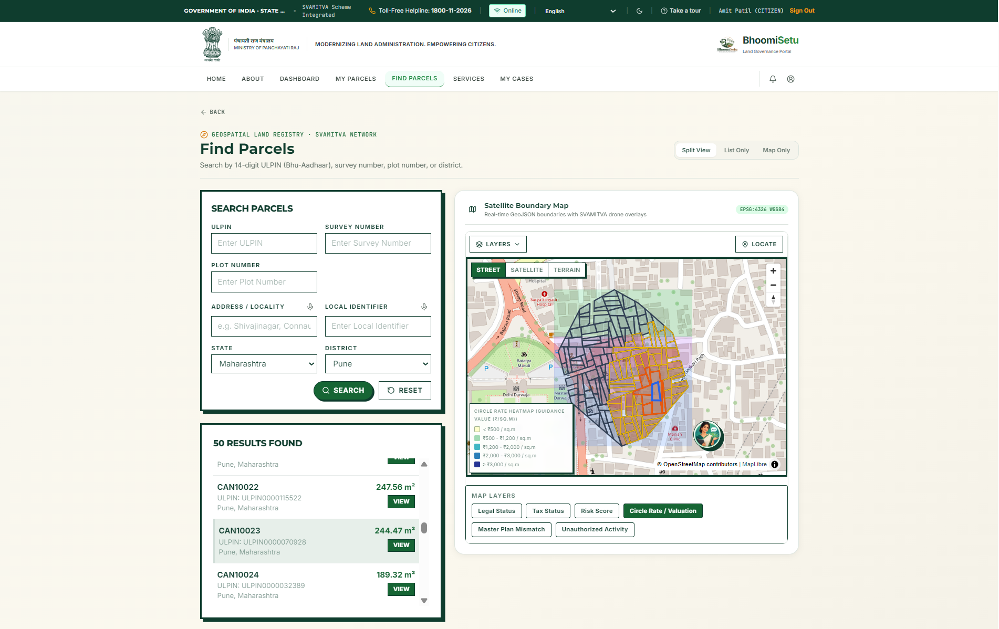
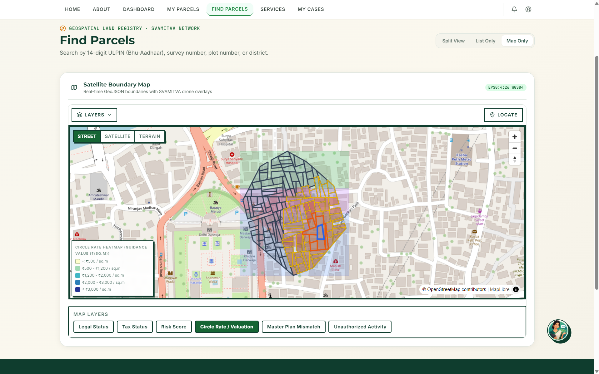
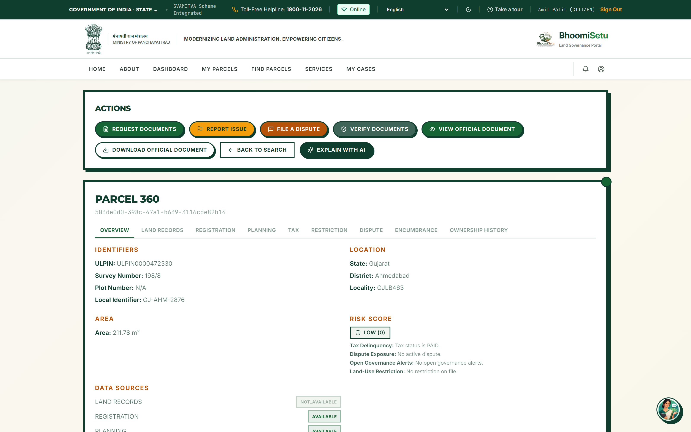
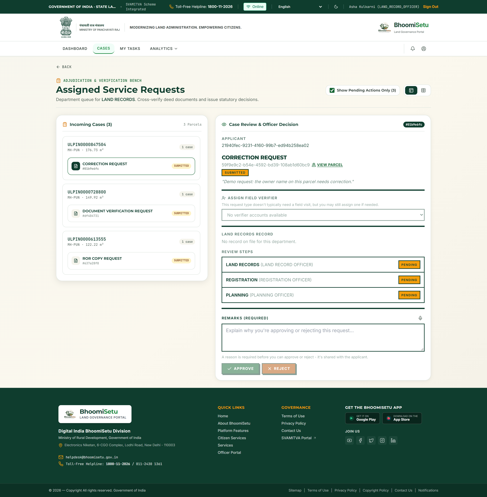
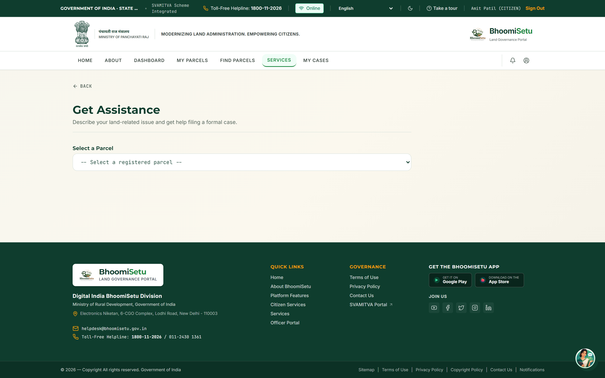
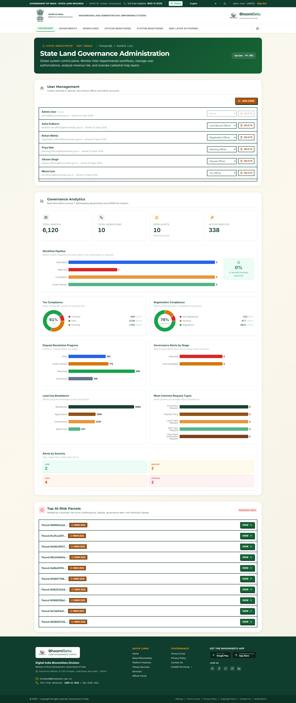

<div align="center">


# BhoomiSetu

> **One Parcel. Every Record. One Trustedv Workflow.**

An integrated, parcel-centric, GIS-based Digital Public Infrastructure for land governance.
Built for **Smart India Hackathon 2026 · Problem Statement SIH26014 — "Land Stack"** (Department of Land Resources).


-ff9933)

</div>

---

> **Claim labels.** Every non-trivial statement is labelled so a reviewer can tell fact from plan:
> **PS-FACT** (from the official problem statement) · **PROTOTYPE** (runs in the current codebase) ·
> **TEAM DESIGN** (designed, not yet fully built) · **VERIFIED METRIC** (measured on a real run;
> unmeasured slots read **DATA REQUIRED**) · **REFERENCE** (external standard/source). No statistic here is invented.
> Full source of truth: [`docs/BhoomiSetu_Master_Project_Document.md`](docs/BhoomiSetu_Master_Project_Document.md).

## 📑 Table of Contents

- [Overview](#1-overview)
- [Problem Statement](#2-problem-statement)
- [Proposed Solution](#3-proposed-solution)
- [Objectives](#4-objectives)
- [Key Features](#5-key-features)
- [Innovation & Uniqueness](#6-innovation--uniqueness)
- [Target Users & Stakeholders](#7-target-users--stakeholders)
- [System Workflow](#8-system-workflow)
- [System Architecture](#9-system-architecture)
- [Technology Stack](#10-technology-stack)
- [Data Architecture & ER Model](#11-data-architecture--er-model)
- [User Roles & Permissions](#12-user-roles--permissions)
- [GIS / Spatial Architecture](#13-gis--spatial-architecture)
- [AI Architecture](#14-ai-architecture)
- [Security Architecture](#15-security-architecture)
- [Reliability & Offline/PWA](#16-reliability--offline--pwa)
- [Project Structure](#17-project-structure)
- [Installation](#18-installation)
- [Environment Variables](#19-environment-variables)
- [Running the Project](#20-running-the-project)
- [Docker & Deployment](#21-docker--deployment)
- [Demo Workflow](#22-demo-workflow)
- [Screenshots](#-screenshots)
- [Testing](#23-testing)
- [Performance & Scalability](#24-performance--scalability)
- [Challenges & Solutions](#25-challenges--solutions)
- [Limitations](#26-limitations)
- [Future Scope](#27-future-scope)
- [Team](#28-team) · [References](#29-references) · [License](#30-license)

---

## 1. Overview

**BhoomiSetu** ("Bhoomi" = land, "Setu" = bridge) is a **functional prototype** of an integrated GIS-based Land Stack: a single interoperable platform that binds every land-related dataset — cadastral geometry, Record of Rights, registration, planning/zoning, taxation, restrictions, encumbrances, disputes, and survey — to **one shared parcel record**, and drives every citizen and departmental interaction through **one auditable workflow engine**.

The problem the PS names is fragmentation: *"land governance involves multiple institutions maintaining information in fragmented, disconnected systems"* **(PS-FACT)**. BhoomiSetu treats the **parcel** as the integration primitive — every record, workflow, and map layer hangs off a parcel keyed by **ULPIN** (the PS-suggested national identifier) plus an internal `canonicalParcelId`.

**What exists today (PROTOTYPE):** a running React + FastAPI application with real PostGIS spatial queries over **~6,120 seeded parcels across 58 clusters in 30 States/UTs**, 32 implemented features, 8 departmental officer roles, an AI assistant + AI request-routing (Groq), OCR document verification, satellite change-detection via Google Earth Engine, an 11-language Bhashini UI, a unified case-management engine, RBAC + JWT + audit logging throughout, and an offline-first PWA (IndexedDB op-queue → idempotent server sync) for low-connectivity field use.

**What is designed but not fully built (TEAM DESIGN):** the full multi-department resolution engine with SLA sweeping, the complete geometry-versioning survey workflow, and the ML-based (rather than heuristic) predictive layer. These are labelled honestly throughout — the PS asks for a *scalable prototype*.

> **The one-sentence pitch:** each officer sees only their department's slice of work, but every action writes back to one shared parcel record — a mutation approval auto-updates tax liability, a restriction flag blocks encumbrance registration elsewhere, a dispute pauses pending registration on the same survey number. That cross-department consistency is the actual problem statement — not any single dashboard.

---

## 2. Problem Statement

**SIH26014 — *Land Stack*** *(PS-FACT):* an integrated GIS-based digital platform bringing all land-related datasets, workflows, and services into a single interoperable framework.

**Context (PS-FACT):** The Department of Land Resources launched Land Stack pilots in **Chandigarh and Tamil Nadu on 31 December 2025**, with proposed expansion to one city and one village per State/UT, then nationwide. The central difficulty: **land is a State subject** — record formats, database structures, units of measurement, field sets, language, terminology, and workflows vary across states. The challenge is a *scalable prototype capable of integrating diverse datasets into a common interoperable State-level framework*, plus a **Standard Technical Document** covering API/interoperability standards, data schemas, architecture, GIS standards, security, UI/UX and deployment.

### PS requirement → BhoomiSetu module

| PS requirement (paraphrased, PS-FACT) | BhoomiSetu module | Status |
|---|---|---|
| Georeferenced cadastral maps, parcel boundaries, ULPIN base layer | PostGIS parcel geometry (SRID 4326) + `ulpin`/`canonicalParcelId` | PROTOTYPE |
| Essential layers: RoR, registration, master plan, permits, encumbrance, land use/zoning | Department record tables + spatial zoning overlays, parcel-linked | PROTOTYPE (partial) |
| Additional layers: utility infra, taxation, valuation, environmental/restriction zones | Infrastructure/restriction overlays + tax records + value-band column | PROTOTYPE |
| Parcel uniquely identifiable, linked to multiple governance layers | Parcel 360° aggregated view | PROTOTYPE |
| Parcel-level GIS visualization + data exploration | MapLibre client + `/gis` GeoJSON + MVT vector tiles | PROTOTYPE |
| Interoperability via open APIs, standardized metadata | Canonical model + State Adapters (`state_a`/`state_b`) | PROTOTYPE (2) / TEAM DESIGN (N) |
| Secure auth, RBAC, audit trails | JWT + `require_roles()` RBAC + `audit_logs` | PROTOTYPE |
| Citizen features: search, ownership verification, status tracking, requests | Citizen portal + case tracking + "Get Assistance" AI intake | PROTOTYPE |
| AI/ML, satellite change detection, predictive analytics, decision-support | Groq assistant/routing, Earth Engine change detection, risk heuristic, analytics | PROTOTYPE (heuristic) / TEAM DESIGN (trained ML) |
| Modular, scalable, replicable national framework | Configurable pipelines, per-state adapters, cluster-per-state seeding | PROTOTYPE + TEAM DESIGN |
| Standard Technical Document | [Master Project Document](docs/BhoomiSetu_Master_Project_Document.md) | PROTOTYPE |

### The fragmentation each department suffers

The PS names fragmented institutions explicitly. BhoomiSetu models each as a first-class officer role (7 named in the PS + Dispute as operational glue + Survey for spatial integrity):

- **Registration ↔ Land Records:** a registered sale deed may never reach the RoR (the classic gap).
- **Tax ↔ Land Records:** tax assessed on stale area/classification after a mutation.
- **Restriction ↔ everything:** ceiling/forest-flagged land silently transferable via another dept.
- **Encumbrance ↔ Dispute ↔ Restriction:** disputed/restricted land mortgaged through a blind spot.
- **Survey ↔ RoR/Tax/Planning:** ad-hoc geometry edits with no audit or propagation.

---

## 3. Proposed Solution

BhoomiSetu is a three-tier web platform with a spatial database core, built on **five pillars**:

1. **Parcel-centric core (PROTOTYPE)** — one hub table (`parcels`) with geometry + precomputed governance columns; everything else references it.
2. **Interoperability layer (PROTOTYPE, 2 adapters)** — canonical envelope + State Adapters normalize diverse state schemas *without replacing them*.
3. **Workflow / case engine (PROTOTYPE)** — one citizen request becomes one case fanning out to multiple department tasks, each auditable.
4. **GIS + spatial intelligence (PROTOTYPE)** — real PostGIS queries, MVT tiles, satellite change detection, spatial-overlap computation.
5. **AI as decision-support (PROTOTYPE)** — Groq-backed intake/routing/explanation, always human-in-loop, never authoritative.

**Design principle:** BhoomiSetu does **not** replace department systems (land is a State subject — that would be politically and technically infeasible). It sits above them as an interoperability + workflow layer, ingesting through adapters and writing back through the same.

### Problem → Solution mapping (spine of the project)

| Gap (PS-FACT) | BhoomiSetu mechanism | Status |
|---|---|---|
| Fragmented, disconnected systems | Single canonical parcel record; every table FKs to `canonicalParcelId` | PROTOTYPE |
| Limited interoperability | Canonical envelope + State Adapters (unit normalization) | PROTOTYPE (2) / TEAM DESIGN (N) |
| Delays obtaining ownership info | Parcel 360° — one query returns ownership + all linked records | PROTOTYPE |
| Lack of transaction transparency | Case timeline + status tracking + audit log | PROTOTYPE |
| Diverse state formats/units | Adapter converts (hectares×10 000; sqft÷10.7639) → canonical m² | PROTOTYPE |
| No spatial framework | PostGIS geometry per parcel; every layer spatially queryable | PROTOTYPE |
| No change detection | Earth Engine Sentinel-2 NDVI → governance alerts | PROTOTYPE |
| No decision support | Pre-assembled evidence chain; AI explanations; risk score | PROTOTYPE |

---

## 4. Objectives

- Bind every land dataset to **one shared parcel record** keyed by ULPIN + `canonicalParcelId`.
- Drive every citizen/departmental interaction through **one auditable workflow engine**.
- Deliver **cross-department consistency** — a decision in one department propagates to others on the same parcel.
- Respect *land is a State subject* via a **canonical-model-plus-adapters** design (coexist, don't replace).
- Provide **parcel-level GIS visualization** with real spatial SQL and vector tiles at scale.
- Make governance **transparent and multilingual** (11 languages, voice I/O, status tracking, audit trail).
- Use **AI as an interface, never an authority** — human-in-loop, schema-validated, never runs SQL.
- Produce the PS-required **Standard Technical Document** with every claim traceable to code or a labelled design.

---

## 5. Key Features

Grouped by portal. All listed here are **PROTOTYPE** unless marked.

### 5.1 Core / platform
- Single canonical parcel record (`parcels` hub) with precomputed governance columns.
- Unified **case-management engine**: `CREATED → ACTIVE → RESOLUTION → FEEDBACK → CLOSED`, one case → many `DepartmentTask`s.
- Configurable workflow pipelines (`workflow_pipeline_configs`) — admin defines per-request-type department order.
- RBAC (11 roles), JWT auth, and full **audit logging** on every mutation.
- Canonical envelope + **State A/B adapters** (unit/identifier normalization).

### 5.2 Citizen features
- Parcel search, **My Parcels**, ownership verification, case/status tracking.
- **"Get Assistance"** AI intake (free-text/voice → classified, auto-routed case).
- 11-language UI with TTS/ASR (Bhashini); bilingual SMS/Email notifications.
- Offline-first PWA — file/track from a low-connectivity field device.

### 5.3 Officer features (×8 departments)
- Department-scoped queue with **pre-assembled evidence chains** (Parcel 360° + OCR match% + history).
- Decisions require a **mandatory reason** (surfaced to citizen, audit-logged).
- Field-verification assignment to Verifiers; side-by-side geometry/area-delta review (Survey).

### 5.4 Admin features
- User/role management, layer/rule configuration, "Workflow Oversight" pipeline editor.
- Admin-only map-notes layer (ADMIN-gated even on reads).

### 5.5 GIS features
- Real PostGIS spatial SQL (`ST_Intersects`, `ST_Contains`, `ST_AsMVT`), GIST-indexed.
- **20 map layers** across 4 source types; MVT vector tiles at `/tiles/{z}/{x}/{y}.pbf`.
- Real Indian geometry — parcels snapped to OSM roads (313,927 highways from Geofabrik PBF).

### 5.6 AI features
- Groq assistant (`openai/gpt-oss-20b`), parcel/alert explanation, intake/routing.
- OCR document verification (pytesseract + OpenCV tamper heuristic).
- Transparent risk-score heuristic (tax 0.4 / dispute 0.3 / alerts 0.2 / restriction 0.1) with per-factor rationale.
- Satellite change detection (Earth Engine Sentinel-2 NDVI) → governance alerts.

---

## 6. Innovation & Uniqueness

Grouped into honesty tiers so reviewers can weigh them fairly.

**Tier B — PS-required, done well:** canonical model + State Adapters (real hectares↔m²↔sqft normalization); real PostGIS + MVT vector tiles (not GeoJSON-over-HTTP); satellite change detection (Sentinel-2 NDVI, live-verified: Pune cluster → 75 parcels → 75 alerts); 11-language Bhashini UI with TTS/ASR; configurable workflow pipelines.

**Tier C — genuine differentiators (beyond the PS):**
1. **Cross-department consistency as the product** (PROTOTYPE substrate + TEAM DESIGN rules) — one shared record means a restriction can *block* an encumbrance, a dispute can *pause* a registration, a survey correction *propagates* area to RoR/Tax/Planning. Fragmented systems structurally cannot do this.
2. **AI as interface, never authority** (PROTOTYPE) — the LLM classifies intent and drafts structured requests but never runs SQL and never turns an allegation into a fact; every response is schema-validated (a failure is a 502, never silently trusted).
3. **Separation of duties via role topology** (PROTOTYPE) — the Verifier role is *structurally* excluded from staff roles, so a verifier account cannot call approve endpoints — enforced by the role split, not extra guard code.
4. **Pre-assembled evidence chains** (PROTOTYPE) — complaint + OCR-verified document + verifier geo-photos + prior claim history assembled in one view before an officer opens a case.
5. **Transparent, explainable risk score** (PROTOTYPE) — a hand-weighted heuristic with plain-language rationale, chosen deliberately over a black-box model because *no labelled outcome data exists to train or validate one*.
6. **History-preserving, geometry-versioned writes** (PROTOTYPE) — mutations append; geometry is versioned (`case_parcel_geometry_versions`); nothing is destroyed.
7. **Offline-first field operation** (PROTOTYPE) — a PWA with an IndexedDB op-queue drains to an idempotent, server-authoritative `/sync` endpoint that re-enforces RBAC and the one-active-case invariant.

> *Anyone can build eight dashboards. BhoomiSetu's innovation is that the eight dashboards write to one record with cross-department rules — the fragmentation problem solved, not merely displayed.*

---

## 7. Target Users & Stakeholders

| Role (PROTOTYPE) | Real-world equivalent | Responsibilities |
|---|---|---|
| **Citizen** | Landowner / applicant | Search parcels, verify ownership, file & track requests |
| **Land Record Officer** | Talathi / Tehsildar | RoR, 7/12, mutation & name/area correction |
| **Registration Officer** | Sub-Registrar (IGR) | Deed registration; duplicate-registration flagging |
| **Planning Officer** | Town Planning authority | Building permission, land-use, zoning-conflict checks |
| **Tax Officer** | Revenue / Municipal tax | Tax dispute / reassessment against RoR |
| **Restriction Officer** | Collector's office | Ceiling/forest/gairan restriction flags |
| **Encumbrance Officer** | Sub-Registrar EC wing | EC requests, mortgage entries, over-leverage checks |
| **Dispute Officer** | Revenue Court | Complaint resolution; Collector-level escalation |
| **Survey Officer** | District Survey Office | Geometry correction, area-delta review, propagation |
| **Verifier** | Field agent | Geo-tagged field evidence (*cannot decide* — role topology) |
| **Admin** | System administrator | Users, roles, layers, rules, workflow pipelines |

---

## 8. System Workflow

The canonical citizen journey, request → resolution:



**Stage labels:** intake/understand/route/case-creation, officer queue, decision, write-back, audit, and verifier evidence are **PROTOTYPE**; automatic cross-department propagation (stage K) is **TEAM DESIGN** — the shared-record substrate that makes it a small change already exists.

**Core invariant:** *one parcel can have only one active request of a given type at a time* (`ACTIVE_CASE_EXISTS` → HTTP 409), **but multiple distinct disputes may coexist** on the same parcel (a boundary dispute and an inheritance dispute are separate matters).

---

## 9. System Architecture

Three-tier, PostGIS-cored (PROTOTYPE unless labelled).



**Layer responsibilities:**
- **Presentation:** stateless React SPA; all authority server-side; map rendered client-side from vector tiles + GeoJSON.
- **Application:** FastAPI enforces auth/RBAC/rate-limit at the edge, runs domain logic in services, offloads expensive recompute to Celery. The LLM never runs SQL — it emits a structured filter the backend executes.
- **Data:** PostGIS is the single source of truth for the canonical record; Redis is cache + Celery broker; department source systems (in production) sit behind adapters.

> **Note:** Gemini (`google-generativeai`) is *configured but not wired* into any AI endpoint — it does not power the assistant. Flagged as configured-but-unused.

---

## 10. Technology Stack

Verified against `frontend/package.json` and `backend-py/requirements.txt`.

| Layer | Technology (version) | Status | Purpose |
|---|---|---|---|
| Frontend | React 18.2 · TypeScript 5.0 · Vite 4.4 · Tailwind 3.3 | PROTOTYPE | Multi-portal SPA |
| Map | MapLibre GL 4.0 · mapbox-gl-draw | PROTOTYPE | Open-source vector-tile renderer (no Mapbox lock-in) |
| State/UI | Zustand 4.4 · react-query 4.32 · Recharts 2.8 | PROTOTYPE | State, server-cache, charts |
| Offline | Dexie 4.4 · idb-keyval 6.3 · vite-plugin-pwa 0.20 | PROTOTYPE | IndexedDB cache + op-queue; installable PWA |
| Backend | FastAPI 0.115 · Pydantic 2.10 | PROTOTYPE | Async, auto-OpenAPI |
| ORM/DB | SQLAlchemy 2.0 · GeoAlchemy2 0.16 · Alembic | PROTOTYPE | ORM + PostGIS types + migrations (incl. GIST) |
| Database | PostgreSQL + PostGIS · Redis 5.2 | PROTOTYPE | Spatial SQL; cache + Celery broker |
| Async | Celery 5.4 | PROTOTYPE | Recompute cols, EE imagery, OCR, ETL |
| Geo tooling | GeoPandas 1.0.1 · Shapely 2.0.6 · osmium 4.3.1 | PROTOTYPE | Geometry ops; OSM PBF parsing |
| Docs/OCR | pytesseract · OpenCV 4.10 · reportlab / PyMuPDF / pypdf | PROTOTYPE | OCR + tamper heuristic + PDF generation |
| AI | openai SDK 1.57 → Groq · earthengine-api 1.4.3 | PROTOTYPE | LLM intake/routing; Sentinel-2 |
| Auth | jose (JWT/HS256) · bcrypt · slowapi | PROTOTYPE | Auth, hashing, rate limit |
| ML libs | PyTorch / scikit-learn | **TEAM DESIGN** | For a *trained* model — today risk is a heuristic |
| Geo (not deps) | GeoServer / Rasterio | **TEAM DESIGN** | Not code dependencies; PostGIS + EE cover current needs |

**External services (PROTOTYPE):** Groq (LLM), Google Earth Engine (Sentinel-2, Community tier), Bhashini (translation/transliteration/TTS/ASR), OpenRouter (historical-comparison narratives only), TextBee (SMS), SMTP (email), Google OAuth + OTP.

> Every choice is open-source or Government of India infrastructure — no vendor lock-in, which matters for a *national framework* states must be able to self-host.

---

## 11. Data Architecture & ER Model

**PROTOTYPE — 59 SQLAlchemy models** (`backend-py/app/models/*.py`), all mapped to one `Base`. Every geometry column is PostGIS `Geometry`, SRID 4326. The PS's Base → Essential → Additional taxonomy is the actual table organization:

- **Base spatial:** `parcels` (hub: geometry + identity + precomputed cols), `parcel_identifiers`, `parcel_neighbours`, `road_networks`, `building_footprints`, `land_cover`, `elevation_tiles`, `parcel_terrain_profiles`.
- **Essential governance:** `ownership_history_records` (RoR), `registration_records`, `planning_records`, `tax_records`, `restriction_records`, `encumbrance_records`/`_certificates`, `dispute_records`, `survey_records`/`survey_documents`, `zoning_overlays`, `restriction_zones`.
- **Additional / derived:** `infrastructure_features`, `change_detection_events`, `governance_alerts`, `crop_records`, `admin_map_notes`, precomputed columns (`risk_score`/`value_band`/`masterplan_mismatch`).
- **Interop:** `state_a_land_records`, `state_b_land_records` (adapter source shapes).
- **Offline:** `processed_sync_operations` (idempotency ledger for `/sync`).



The hub table `parcels` carries **precomputed governance columns** (`tax_status`, `legal_status_severity`, `value_band`, `risk_score`, `masterplan_mismatch`, `unauthorized_construction_suspected`, `cluster_id`, `ulpin`, `current_state`) — denormalized on purpose so a vector-tile renderer coloring 6,000 parcels never runs 6,000 join-and-aggregate queries. Celery recomputes them. **History is never destroyed** — every domain has a history table plus per-year snapshots and versioned geometry; a mutation *appends*.

---

## 12. User Roles & Permissions

RBAC via `require_roles(*roles)` → **403** on role mismatch, **401** if unauthenticated. **11 roles.**

| Role group | Roles | Access |
|---|---|---|
| Officers (8) | `LAND_RECORD`, `REGISTRATION`, `PLANNING`, `DISPUTE`, `TAX`, `RESTRICTION`, `ENCUMBRANCE`, `SURVEY` | Own department queue; approve/reject with mandatory reason |
| Admin | `ADMIN` | Users, roles, layers, rules, pipelines; admin-notes layer |
| Citizen | `CITIZEN` | Only parcels linked to their account; own cases |
| Verifier | `VERIFIER` | Field evidence only — **structurally excluded** from `OFFICER_ROLES`/`ALL_STAFF_ROLES`, so cannot reach approve endpoints |

**Separation of duties** is enforced by *topology*: because `VERIFIER_ROLE` sits outside the staff-role sets, a verifier account cannot call staff endpoints — no extra guard code needed. Data-scoping: citizens see only their parcels; ownership history is citizen-restricted; admin-notes are ADMIN-gated even on reads.

---

## 13. GIS / Spatial Architecture

**PROTOTYPE — real PostGIS, no SQLite fallback.** The current `backend-py` backend stores native PostGIS `Geometry(SRID 4326)` and runs real spatial SQL (any older doc claiming a SQLite path is stale).

- **CRS:** SRID **4326** (WGS84) throughout — the interoperable baseline **(REFERENCE: OGC GeoJSON RFC 7946)**. Tiles transformed to EPSG:3857 for web-mercator.
- **Spatial indexing:** GIST indexes on all geometry columns, added by Alembic migration (not the model definition) — without GIST a viewport query is a full table scan.
- **Vector tiles:** `app/routers/map_tiles.py` serves Mapbox Vector Tiles at `/api/v1/tiles/{z}/{x}/{y}.pbf` (+ roads/buildings/landcover/elevation) via `ST_AsMVT`/`ST_AsMVTGeom`/`ST_TileEnvelope`, extent 4096, buffer 64 **(REFERENCE: Mapbox Vector Tile spec)**.
- **Real-world geometry:** seeded parcels are topology-aware, **snapped to real OSM roads** (313,927 highways from 6 Geofabrik India-zone PBF files), sized to standard Indian residential plots.

| Operation | PostGIS function | Endpoint |
|---|---|---|
| Viewport / bbox load | `ST_Intersects(geom, ST_MakeEnvelope(…,4326))` | `GET /gis/parcels` |
| Cluster hierarchy bounds | `ST_XMin/YMin/XMax/YMax` | `GET /gis/clusters-hierarchical` |
| Point-in-parcel | `ST_Contains` / `ST_Centroid` | change detection, spatial overlap |
| Neighbours | `parcel_neighbours` (TOUCHING\|NEARBY), precomputed | `/parcels/…/context` |

**20 `LayerKey` values / 4 source types:** parcel relationships (`/gis/parcels` + neighbours), attribute colouring (precomputed columns), GIS overlays (`/gis/*` GeoJSON), MVT tiles (`/tiles/*.pbf`).

---

## 14. AI Architecture

**Governing principle (PROTOTYPE):** AI is the *interface*, never the *authority*.

- **Primary LLM: Groq** (`groq_service.py`) via the OpenAI-compatible SDK, default model `openai/gpt-oss-20b`.
- **Every AI response is validated against a Pydantic schema.** A validation failure raises `AiResponseValidationError` → **HTTP 502**. The system never acts on unvalidated output.
- **The LLM never runs SQL.** For data queries it emits a *structured filter* (state/district/tax_status/…); the backend executes the real query — eliminating prompt-injection-to-SQL and hallucinated data.
- Without an API key, endpoints degrade to **503** (never a crash). Rate-limited 30 req/min/IP.
- **No RAG / vector store** — "grounding" injects real DB rows into the prompt (grounded prompting, honestly labelled).

**AI-based request routing (PROTOTYPE):** `request_routing_service.py` — Groq classifies a free-text request against the 8 real department codes, validated against a closed set. **On any failure it falls back to a deterministic `pipeline_for()`** — routing is never a single point of failure. Live-verified: a tax-bill complaint routed to `TAX` alone with the model's actual rationale.



**Why heuristic over trained ML for risk (PROTOTYPE):** the score is a transparent weighted sum with per-factor rationale, chosen because there is *no labelled ground-truth dataset* to train or validate a model — a fabricated accuracy number would be dishonest. A trained model is **TEAM DESIGN**, contingent on real outcome data.

---

## 15. Security Architecture

The PS requires *secure authentication, RBAC, and audit trails* **(PS-FACT)**. All three are PROTOTYPE.

**Authentication (PROTOTYPE):**
- **JWT (HS256, `jose`)**, secret from `JWT_SECRET`. Token embeds `sub/email/role/tokenVersion`.
- **No `exp` claim by design** — sessions persist until explicit logout bumps `token_version`; optional idle timeout (`idle_timeout_minutes`, default 0). *A production deployment should enable idle timeout / short-lived tokens* (TEAM DESIGN hardening).
- User looked up fresh every request; stale `token_version` or deleted user → 401. Password hashing: **bcrypt**.
- **Per-account brute-force lockout (PROTOTYPE):** `app/auth/login_guard.py` locks an identifier for **15 minutes after 5 failed logins**, returning **429 before credential validation** — a second layer independent of the per-IP limiter, closing the distributed-guess gap. In-memory/process-local (move to a shared store if multi-instance — TEAM DESIGN).
- Registration supports OTP + Google OAuth.

**Authorization / RBAC (PROTOTYPE):** `require_roles()` (see §12); separation of duties by role topology; citizen data-scoping.

**Audit trail (PROTOTYPE):** `audit_logs` records every material mutation, actor-attributed — the sole place an *individual* officer (not just a role) is tied to a decision.

**Transport & deployment hardening (PROTOTYPE):**
- CORS restricted to an explicit allowlist (`CORS_ORIGIN`).
- Production hard-checks: refuses to boot under `ENVIRONMENT=production` with an unset/placeholder `JWT_SECRET` or missing DB creds; Swagger disabled in production; PostGIS port not published to host.
- **Non-root container:** the backend image runs as an unprivileged user (`useradd --uid 10001 appuser` → `USER appuser`); the app writes only to `/tmp`.
- Rate limiting (slowapi): 200/min default, 30/min on AI/change-detection/historical-imagery, 20/min on OCR.

> **Honesty note:** the no-token-expiry choice and the heuristic (not forensic) document check are labelled as demo-appropriate with named production-hardening upgrades. We do not present the prototype's posture as production-grade.

**Reporting vulnerabilities:** see [`SECURITY.md`](SECURITY.md) for the responsible-disclosure policy, supported versions, and the current list of security measures.

---

## 16. Reliability & Offline / PWA

**Design pattern: *degrade, don't crash.*** Every external dependency has a defined failure mode:

| Dependency | Failure mode | Behaviour (PROTOTYPE) |
|---|---|---|
| Groq (LLM) | unconfigured/error/malformed | AI → 503; routing falls back to deterministic `pipeline_for()` |
| Earth Engine | not configured | change-detection-satellite → clean **503**, not a raw 500 |
| Bhashini | translation fails | `t(key)` falls back to the raw key; UI never crashes |
| OpenRouter | fails/unconfigured | falls back to the same real facts, plainly phrased |
| Celery/Redis | not installed | graceful no-op `shared_task` shim; request unaffected |
| SMS/Email | no verified contact | in-app notification still delivered |
| Client network | field device offline | mutations queue locally (IndexedDB); drain on reconnect to idempotent `/sync` |

### Offline-first field operation (PROTOTYPE)
An installable **PWA** (`vite-plugin-pwa`) backed by a **Dexie/IndexedDB** store (`frontend/src/offline/`):
- **Local workspace, not source of truth** — parcels, Parcel 360°, and cases cached with freshness metadata + `ownerUserId`; a shared field device never leaks one user's data to the next; logout clears the cache.
- **Idempotent op-queue** — every mutation carries a client-generated `operationId`; a `SyncManager` drains to `POST /api/v1/sync` on reconnect. Replaying an `operationId` returns `DUPLICATE` — a dropped response can never double-apply.
- **Server stays authoritative** — `app/routers/sync.py` re-runs the exact online path: RBAC and the one-active-case invariant re-checked server-side, every applied op audited (`CASE_CREATED_OFFLINE_SYNC`); an already-active case returns `CONFLICT`, never a silent overwrite; a `processed_sync_operations` ledger records every terminal outcome.
- **Scope (honest):** offline **case creation** is PROTOTYPE; offline document/evidence sync is the next phase (**TEAM DESIGN**).

**Not yet built (TEAM DESIGN):** automated DB failover, multi-region replication, and an SLA-breach sweeper (SLA configs are stored/queried but not actively swept today).

---

## 17. Project Structure

```text
SIH_2026_BhoomiSetu/
├── backend-py/               # FastAPI backend (LIVE — source of truth)
│   ├── app/
│   │   ├── auth/             # JWT, passwords, login_guard (per-account lockout)
│   │   ├── models/           # 59 SQLAlchemy models (one Base)
│   │   ├── routers/          # 29 router groups (incl. gis, map_tiles, sync, ai)
│   │   ├── services/         # ~40 domain services (case, groq, routing, gis…)
│   │   └── ...
│   ├── alembic/              # migrations (incl. GIST spatial indexes)
│   ├── tests/                # endpoint + service tests
│   ├── docker/               # container assets (non-root user)
│   ├── scripts/              # seeding / ETL scripts
│   └── requirements.txt
├── frontend/                 # React 18 + TS + Vite SPA
│   ├── src/
│   │   ├── features/         # map, pwa, portals
│   │   ├── offline/          # Dexie DB, op-queue, SyncManager (offline PWA)
│   │   ├── services/         # apiService and integrations
│   │   ├── i18n/             # 11-language strings
│   │   └── ...
│   ├── public/               # bhoomisetu-logo.png, PWA assets
│   └── package.json
├── docs/                     # Master Project Document + specs + Logo.png
├── graphify-out/             # knowledge-graph artifacts
└── docker-compose.yml
```

> A retired NestJS backend (`backend/`) is no longer the live backend — `backend-py/` is authoritative.

---

## 18. Installation

### 18.1 Prerequisites
- **Python 3.11+**, **Node.js 18+**, **PostgreSQL 15 + PostGIS 3.3**, **Redis** (optional for async; degrades gracefully), **Tesseract** (for OCR).
- Or just **Docker + Docker Compose** (bundles Postgres/PostGIS, Redis, migrate, worker).

### 18.2 Clone
```bash
git clone <repo-url> SIH_2026_BhoomiSetu
cd SIH_2026_BhoomiSetu
```

### 18.3 Backend setup
```bash
cd backend-py
python -m venv .venv
# Windows PowerShell: .venv\Scripts\Activate.ps1   |  POSIX: source .venv/bin/activate
pip install -r requirements.txt
cp .env.example .env          # then fill in values (see §19)
```

### 18.4 Frontend setup
```bash
cd frontend
npm install
# set VITE_API_URL to your backend base URL (e.g. http://localhost:8000/api/v1)
```

---

## 19. Environment Variables

> **Variable names only** — never commit real values. See `backend-py/.env.example` for the full template. Production refuses to boot with an unset/placeholder `JWT_SECRET` or missing DB credentials.

**Backend (`backend-py/.env`):**

| Group | Variables | Required |
|---|---|---|
| Database | `DB_HOST`, `DB_PORT`, `DB_USERNAME`, `DB_PASSWORD`, `DB_NAME`, `DB_SSL` | Yes |
| App | `PORT`, `ENVIRONMENT`, `CORS_ORIGIN`, `FRONTEND_URL` | Yes |
| Auth | `JWT_SECRET` | Yes |
| LLM | `GROQ_API_KEY`, `GROQ_MODEL` | Optional (degrades to 503) |
| LLM (unused) | `GEMINI_API_KEY`, `GEMINI_MODEL` | Optional (configured, not wired) |
| Narratives | `OPENROUTER_API_KEY`, `OPENROUTER_MODEL` | Optional |
| Satellite | `GEE_SERVICE_ACCOUNT_EMAIL`, `GEE_SERVICE_ACCOUNT_KEY_PATH`, `GEE_SERVICE_ACCOUNT_KEY_JSON` | Optional |
| Multilingual | `ULCA_USER_ID`, `ULCA_API_KEY`, `BHASHINI_PIPELINE_ID`, `DEFAULT_SOURCE_LANG`, `DEFAULT_TARGET_LANG` | Optional |
| SMS | `TEXTBEE_API_KEY`, `TEXTBEE_DEVICE_ID`, `TEXTBEE_SIM_SUBSCRIPTION_ID` | Optional |
| Email | `MAIL_HOST`, `MAIL_PORT`, `MAIL_SECURE`, `MAIL_USER`, `MAIL_PASSWORD`, `MAIL_FROM` | Optional |
| Cache/broker | `REDIS_URL`, `REDIS_HOST`, `REDIS_PORT`, `REDIS_DB` | Optional |
| OAuth | `GOOGLE_OAUTH_CLIENT_ID`, `GOOGLE_OAUTH_CLIENT_SECRET`, `GOOGLE_OAUTH_REDIRECT_URI` | Optional |
| Supabase | `SUPABASE_URL`, `SUPABASE_SECRET_KEY` | Optional |

**Frontend (`frontend/.env`):** `VITE_API_URL` — backend API base URL.

---

## 20. Running the Project

### Development
```bash
# Backend (from backend-py/, venv active)
alembic upgrade head          # apply migrations (creates schema + GIST indexes)
uvicorn app.main:app --reload --port 8000

# Async worker (optional — recompute/imagery; skipped gracefully if absent)
celery -A app.celery_app worker -Q celery,earth_engine,ocr,etl,change_detection,terrain

# Frontend (from frontend/)
npm run dev                   # Vite dev server (default http://localhost:5173)
```

### Production build (frontend)
```bash
npm run build && npm run preview
```

---

## 21. Docker & Deployment

```bash
docker compose up --build
```

| Service | Image / build | Port (host:container) | Purpose |
|---|---|---|---|
| `frontend` | React build (nginx) | `5173:80` | SPA |
| `backend-py` | FastAPI (non-root `appuser`) | `8000:8000` | API |
| `migrate` | alembic | — | `alembic upgrade head` (runs once) |
| `worker` | Celery | — | queues: celery, earth_engine, ocr, etl, change_detection, terrain |
| `redis` | redis:7-alpine (`--appendonly yes`) | — | cache + broker |
| `postgis` | postgis/postgis:15-3.3 | **not published** | PostgreSQL + PostGIS (`bhoomisetu_py`) |

**Deployment hardening (PROTOTYPE):** non-root container, PostGIS port unpublished, Swagger disabled and `JWT_SECRET`/DB creds hard-required under `ENVIRONMENT=production`, CORS allowlist.

---

## 22. Demo Workflow

**Scenario (PROTOTYPE unless labelled):** Asha files a boundary-correction request on her Pune parcel, in Marathi, by voice.

1. **Intake** — Asha opens "Get Assistance", speaks in Marathi. Bhashini ASR → text; UI stays in Marathi.
2. **Understand + route** — `POST /ai/understand` (Groq classifies intent = boundary/survey correction) → `POST /ai/route` → `{departments:[SURVEY], reason:"boundary discrepancy claim"}` (schema-validated; LLM failure → deterministic `pipeline_for()`).
3. **Case creation** — guard checks no active SURVEY case on this parcel (else 409); case `CREATED→ACTIVE`; SURVEY `DepartmentTask` spawned; timeline event + audit logged.
4. **Evidence assembly** — officer opens Parcel 360°: current geometry, RoR area, prior survey records, neighbours, prior boundary claims — pre-assembled.
5. **Field verification** — officer assigns a Verifier → GPS-tagged photo + measurement notes via `/workflows/{id}/field-evidence`. Verifier cannot decide (role topology).
6. **Decision** — Survey Officer compares current vs measured geometry (area delta), approves corrected polygon with a mandatory reason. Write is transactional; geometry versioned.
7. **Propagation (TEAM DESIGN)** — approved area change notifies Land Records (RoR), Tax (reassessment), Planning (zoning check).
8. **Closure + feedback** — case → RESOLUTION → FEEDBACK; Asha notified (in-app + bilingual SMS/Email), tracks status, leaves feedback. Every step is in the audit log and case timeline.

**Robustness:** even with **no API keys set**, the case engine, GIS, RBAC, and audit all function — AI/imagery/i18n paths degrade to defined fallbacks.

---

## 📸 Screenshots

> Captured against the seeded demo dataset (`backend-py/scripts/seed.py`). PROTOTYPE.

### Cadastral GIS Map — risk & valuation layers
Citizen *Find Parcels* view: GeoJSON parcel boundaries over street/satellite/terrain basemaps, with toggleable Legal Status, Tax Status, Risk Score, Circle Rate / Valuation, Master Plan Mismatch and Unauthorized Activity layers.




### Parcel 360°
Single-parcel dossier: identifiers (ULPIN, survey no.), location, area, computed risk score, and per-department data-source availability across Overview / Land Records / Registration / Planning / Tax / Restriction / Dispute / Encumbrance / Ownership History tabs.



### Officer — Case Review & Decision Bench
Department queue (Land Records) with incoming cases, per-case review panel, workflow steps, field-verifier assignment, and a mandatory-reason approve/reject decision.



### Citizen — AI-Assisted Assistance
Multilingual, voice-capable intake that classifies intent and routes to the right department(s).



### Admin Dashboard
System-wide administration and monitoring overview.



---

## 23. Testing

```bash
cd backend-py && pytest              # endpoint + service tests
cd frontend && npm run test          # vitest
```

| Layer | What | Method | Status |
|---|---|---|---|
| Spatial SQL | bbox, contains, MVT | live Postgres+PostGIS | ✅ verified |
| Auth/RBAC | role gates, token version, per-account failed-login lockout (`test_login_lockout.py`) | unit/endpoint | ✅ |
| Case engine | lifecycle transitions, `ACTIVE_CASE_EXISTS` guard | unit | ✅ |
| AI routing | fallback on no key, closed-set validation | unit (fallback exercised for real — no `GROQ_API_KEY` in test env) | ✅ |
| Change detection | image + satellite → alerts | live EE run (Pune → 75/75) | ✅ verified |
| Verifier | assign, field-evidence, role separation | endpoint | ✅ |
| Offline sync | idempotent replay (`DUPLICATE`), server-side invariant re-check, `CONFLICT` | endpoint | ✅ |
| Official PDF | `%PDF-` signature only | unit | 🔶 gap: no value assertions (TEAM DESIGN) |
| Frontend i18n | label coverage | vitest | 🔶 drift being reconciled against `en.json` |
| Load / latency | throughput, tile-serve time | — | ❌ **DATA REQUIRED** — not yet measured |

---

## 24. Performance & Scalability

**Optimizations (PROTOTYPE):** MVT vector tiles (DB emits only in-view geometry — scales with *viewport*, not parcel count) · GIST spatial indexes · precomputed governance columns (colour thousands of parcels without per-parcel joins) · async Celery recompute · react-query caching · cached UI-text files (~694 keys served static, not live Bhashini) · on-demand satellite with imagery reuse · precomputed `parcel_neighbours`.

**Scaling path:** Pilot (6K parcels, 1 Postgres) **[PROTOTYPE]** → State rollout (millions/state, partitioned Postgres, autoscaled API/workers, CDN tiles) **[TEAM DESIGN]** → National (per-state deployments + central canonical registry, N adapters) **[TEAM DESIGN]**. Because rendering reads tiles + precomputed columns (not live joins) and interoperability is additive (adapters), the marginal cost of the next state or the next million parcels is *infrastructure*, not *re-architecture*.

> **Performance numbers are DATA REQUIRED** — no tile-serve time, query latency, or throughput figure is quoted here; those must be measured on a real run. The *architecture* is optimized for the right cost model; the *numbers* are a measurement task.

---

## 25. Challenges & Solutions

| Challenge | Solution | Status |
|---|---|---|
| Rendering thousands of parcels without melting the browser | Database-side MVT tiles (`ST_AsMVT`), GIST-indexed; attribute colouring from precomputed columns | PROTOTYPE |
| Cross-department consistency without distributed-transaction hell | Single canonical record + transactional, history-preserving write-back; rules against the shared record (avoids 2-phase commit) | PROTOTYPE substrate / TEAM DESIGN rules |
| Diverse state schemas / units / languages | Canonical envelope + adapters (hectares×10 000, sqft÷10.7639, identifier resolver); new state = new adapter class | PROTOTYPE (2) / TEAM DESIGN (N) |
| Making AI safe in a legal-records context | Schema-validated responses (502 on fail), LLM emits filters not SQL, deterministic routing fallback, human-in-loop | PROTOTYPE |
| Keeping precomputed columns fresh without blocking requests | Async Celery recompute; graceful no-op shim when Celery absent | PROTOTYPE |
| Geometry correction without corrupting the cadastre | Versioned geometry (`case_parcel_geometry_versions`), Survey-Officer-owned, area-delta review | PROTOTYPE model / TEAM DESIGN workflow |
| Satellite quota & latency | On-demand (not auto) fetches, 90s client timeout, imagery reuse across features | PROTOTYPE |

---

## 26. Limitations

Documented honestly (not hidden):

- **Automatic cross-department propagation rules** (tax reassess, restriction-blocks-encumbrance, dispute-pauses-registration) are **TEAM DESIGN** — the shared-record substrate exists; the enforced rules do not yet.
- **SLA-breach sweeper** not built — SLA configs are stored and queried, not actively swept.
- **Official-PDF integration gaps** — applicant profile fields not passed into the PDF; single-page canvas can overflow on long history; download-only (no inline viewer); tests verify `%PDF-` signature only.
- **Risk score is a heuristic**, not a trained model (no labelled outcome data to validate one).
- **Interoperability proven for 2 states**; N-state expansion is additive but not yet done.
- **Offline sync covers case creation only**; document/evidence sync is the next phase.
- **Security demo choices:** no JWT `exp` by default; login lockout is process-local (single-instance); OpenCV document check is a heuristic tamper signal, not forensic authentication.
- **No performance/load numbers** — DATA REQUIRED, not yet measured.
- **Digitally-issued RoR/EC legal weight** requires statutory backing (a policy dependency, not a technical one).

---

## 27. Future Scope

Ordered by dependency and value (all **TEAM DESIGN**):

1. **Complete cross-department propagation engine** — turn specified rules into enforced invariants (highest-value next step; substrate exists).
2. **SLA enforcement sweeper** — a Celery task sweeping `sla_configs` and raising breach alerts.
3. **N-state adapter expansion** — the direct path to the PS's nationwide goal.
4. **Trained ML predictive layer** — replace the heuristic risk score once labelled outcome data exists.
5. **Official-document completion** — profile block, multi-page layout, inline viewer, value-level tests.
6. **Mobile-native app** — the API + vector tiles already support a native client.
7. **DPI integrations** — DigiLocker, Aadhaar e-KYC (policy-gated), UPI fee payment.
8. **Advanced geospatial** — drone/high-res imagery, automated boundary extraction, encroachment ML.
9. **Production HA** — multi-region replication, automated failover, CDN-fronted tiles.

---

## 28. Team

> Team members, roles, and contributions are **not documented in the source** (`BhoomiSetu_Master_Project_Document.md`). This section is intentionally left as a placeholder rather than fabricated — fill it in before submission.

| Member | Role | Contribution |
|---|---|---|
| _TBD_ | _TBD_ | _TBD_ |

---

## 29. References

**Standards & specifications (REFERENCE):**
- OGC GeoJSON — IETF RFC 7946 (SRID 4326 / WGS84 geometry encoding).
- Mapbox Vector Tile Specification (`.pbf` tiles served via `ST_AsMVT`).
- OpenAPI Specification (auto-generated by FastAPI).
- WGS84 (EPSG:4326) / Web Mercator (EPSG:3857) coordinate reference systems.

**Government of India infrastructure & policy (REFERENCE):**
- Department of Land Resources — Land Stack initiative (PS SIH26014; pilots Chandigarh & Tamil Nadu, 31 Dec 2025).
- ULPIN — DILRMP / Digital India Land Records Modernization Programme.
- Bhashini — National Language Translation Mission (ULCA/Dhruva APIs).

**Data & geospatial sources (REFERENCE):**
- Google Earth Engine — Sentinel-2 imagery (Copernicus/ESA), Community tier.
- OpenStreetMap / Geofabrik India-zone PBF extracts (road networks).
- PostGIS — spatial extension for PostgreSQL.

**Internal project documents:**
- [`docs/BhoomiSetu_Master_Project_Document.md`](docs/BhoomiSetu_Master_Project_Document.md) — Standard Technical Document (single source of truth).
- `docs/BhoomiSetu_Unified_Workflow_Specification.md`, `docs/bhoomisetu_officer_roles.md`, `docs/architecture/FEATURES.md`.

> **Metrics deliberately omitted:** any performance, accuracy, or cost figure not measured on a real run is marked **DATA REQUIRED** in-place rather than cited. No source is invented.

---

## 30. License

Released under the **MIT License** — see [`LICENSE`](LICENSE). Copyright (c) 2026 BhoomiSetu.

---

<div align="center">

**One Parcel. Every Record. One Trusted Workflow.**

*Built for Smart India Hackathon 2026 · Problem Statement SIH26014 — "Land Stack"*

</div>
